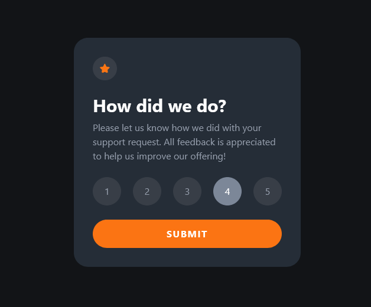

# Frontend Mentor - Interactive rating component solution

This is a solution to the [Interactive rating component challenge on Frontend Mentor](https://www.frontendmentor.io/challenges/interactive-rating-component-koxpeBUmI). Frontend Mentor challenges help you improve your coding skills by building realistic projects.

## Table of contents

- [Overview](#overview)
  - [The challenge](#the-challenge)
  - [Screenshot](#screenshot)
  - [Links](#links)
- [My process](#my-process)
  - [Built with](#built-with)
  - [What I learned](#what-i-learned)
  - [Continued development](#continued-development)
- [Author](#author)
- [Acknowledgments](#acknowledgments)

**Note: Delete this note and update the table of contents based on what sections you keep.**

## Overview

### The challenge

Users should be able to:

- View the optimal layout for the app depending on their device's screen size
- See hover states for all interactive elements on the page
- Select and submit a number rating
- See the "Thank you" card state after submitting a rating

### Screenshot

### Links

- Solution URL: [Github Repository](https://your-solution-url.com)
- Live Site URL: [Github Live Page](https://your-live-site-url.com)

## My process

Built With

- Semantic HTML Markup
- TailwindCSS (used for styling in the HTML)
- JavaScript
- Parcel Bundler

### What I Learned

While implementing this code, several key concepts and techniques were applied:

- **Event Handling**: The code effectively utilizes event listeners to capture user interactions such as clicking on rating options and submitting the rating.

- **DOM Manipulation**: It demonstrates how to manipulate the Document Object Model (DOM) by selecting and modifying HTML elements to reflect user choices.

- **TailwindCSS Classes**: TailwindCSS classes are used to dynamically change the appearance of elements based on user interactions, improving the user experience.

- **Toggle Functionality**: The code employs a toggle mechanism to switch between the main rating card and the success message card, allowing users to view their selected rating and a thank-you message.

- **Guard Clauses**: A guard clause is implemented to prevent rating submission when no rating option is selected, ensuring data integrity.

- **Keyboard Events**: The code listens for keyboard events, specifically the "Escape" key, to cancel the rating submission and return to the initial state.

- **Parcel Bundler**: Finally, Parcel was used to bundle the whole package.

### Continued Development

- **Backend Integration**: Implement functionality to send the selected rating to a server for data storage or processing.

- **Animations**: Incorporate smooth animations to provide a more engaging and visually appealing user experience.

- **Accessibility**: Ensure that the rating component is fully accessible to users with disabilities by providing appropriate ARIA attributes and keyboard navigation.

## Author

- Frontend Mentor - [@HectorKayman](https://www.frontendmentor.io/profile/HectorKayman)

## Acknowledgments

I'd like to thank Frontend Mentor for providing this challenge.

---
